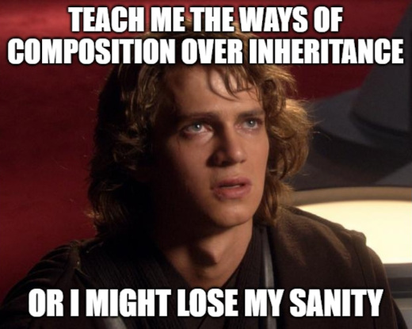

# Hereditary

Procedural macros for emulating OOP Inheritance in Rust, 
by extending the trait functionality in structs based on their composition
(as they contain instances of other types that implement the desired functionality).



`Hereditary` generates the boilerplate of trait implementations for the composited struct,
by [**Forwarding**](https://en.wikipedia.org/wiki/Forwarding_%28object-oriented_programming%29) the 
required methods that wrap the functionality already implemented in the contained instances referenced by its struct fields.

Currently, `Hereditary` support 2 kinds of delegation:
- **Partial Delegation**: By using the decorator attribute `#[forward_trait(submember)]` on trait implementations.
- **Full Delegation**: By applying `#[derive(Forwarding)]` on the composited struct, it derives the trait implementation
 on the struct field (designated by attribute `#[forward_derive(Trait)]`).

> **Note**
>
> Learn more in the documentation page here https://docs.rs/hereditary

# Features
- Brings subtype polymorphism on composite structs with just one instruction, vesting
the new type with the same interface as its components.
- Re-use fields/method implementations from other types as subcomponents, without needing to repeately write wrapping code
that forwards the methods of those subcomponents.
- `Hereditary` tools are essentially *zero-cost abstractions*. They don't require runtime structures for holding trait type information. 
All the work it's done by macros and code generation.
- Embrace the [**New Type pattern**](https://www.lurklurk.org/effective-rust/newtype.html) effectively, but without the previous
awkward issues of having to re-implement the `inner-type` interfaces for the `new-type`. By using this technique Rust programmers
avoid the problems of incorporating new behaviour of existing foreign types, bypassing the 
[*Orphan Rule for traits*](https://doc.rust-lang.org/book/ch10-02-traits.html#implementing-a-trait-on-a-type).

# Usage

Install in your repository:
> cargo add hereditary

Insert `hereditary` macros in your code:

```rust
mod animal {
    // Attribute macro for generating trait info
    #[hereditary::trait_info]
    pub trait Cannis {
        fn bark(&self)-> String;
        fn sniff(&self)-> bool; 
    }
    #[hereditary::trait_info]
    pub trait Bird {
       fn sing(&self) -> String;
       fn fly(&mut self, elevation:f64) -> f64; 
    }
}

// Heritance for an hybrid animal
#[derive(hereditary::Forwarding)]
struct KimeraSphinx 
{    
    #[forward_derive(animal::Cannis)] // full implementation of Cannis
    dogpart:Bulldog,
    birdpart:Seagull
}

// Combining existing trait implementation from Seagull instance
#[hereditary::forward_trait(birdpart)]
impl animal::Bird for KimeraSphinx
{
    fn sing(&self) -> String
    {
        self.dogpart.bark()
    }
}

// -- Subcomponent implementations -- //
struct Bulldog { position:f64 }
impl animal::Cannis for Bulldog { 
    //... Cannis methods ...
}
struct Seagull {  elevation:f64 }
impl animal::Bird for Seagull {
     //... Bird methods ...
}

fn main() {
    // Instance kimera
    let mut kimera = KimeraSphinx::new();
    // A dogs that flies.
    assert_eq!(kimera.fly(50f64), 50f64);
    assert_eq!(kimera.bark(), kimera.sing()); // It barks instead of singing
    assert_eq!(kimera.sniff(), true);
}
```

# Limitations
- Because of the heavily usage of macros, code made with `Hereditary` would incurr in longer compilation processes.
- Sometimes, the traits information cannot be referenced by external modules, because `trait_info` generated macros
aren't imported automatically as same as their corresponding traits. That's why they need to be referenced with the full path 
in the forwarding attributes (`animal::Bird`), instead of just `Bird`. This is a known issue related with declarative macros and the scope rules for
their visibibility, as they have special needs when [exporting them as module symbols](https://danielkeep.github.io/tlborm/book/mbe-min-import-export.html).

# License

**Apache 2.0**

**Authors**: [Francisco Leon](https://github.com/superoptimo)